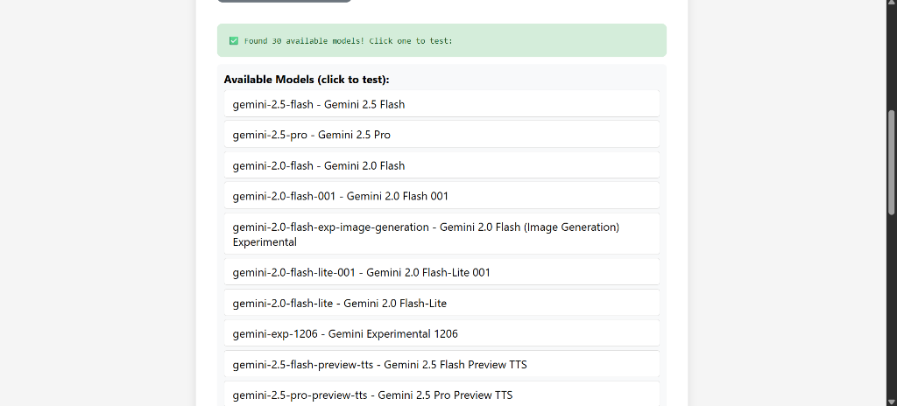
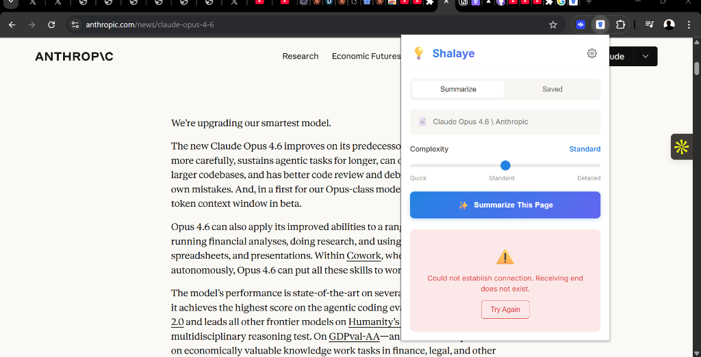

# 📖 Shalaye - Content Simplifier

**Shalaye** simplifies web content instantly. Perfect for users with low attention spans, cognitive overload, or anyone who wants quick, digestible summaries.

> *"Shalaye"* means "to explain" in Nigerian Pidgin English 🇳🇬


---

## 📸 Screenshots

### Dark Theme - Clean Popup UI


### Quick Explain Feature


---

## ✨ Features

- **One-Click Summarization** - Summarize any article, blog, or documentation instantly
- **Adjustable Complexity** - Choose Quick, Standard, or Detailed summaries
- **Key Takeaways** - Get bullet-pointed main ideas
- **Text-to-Speech** - Listen to summaries read aloud
- **Save & Organize** - Store summaries for later access
- **Quick Explain** - Select confusing text and get instant explanations
- **Light/Dark Mode** - Toggle between themes
- **Dual AI Backend** - Powered by Google Gemini with Groq failover for reliability

---

## 🚀 Powered by Google Gemini

Shalaye uses **Google Gemini 2.0 Flash** as its primary AI engine for:
- Fast, accurate summarization
- Natural language explanations
- Intelligent key point extraction

With **Groq** as an automatic failover for maximum uptime and reliability.

---

## 📦 Installation

### From Source (Developer Mode)

1. **Download or Clone** this repository:
   ```bash
   git clone https://github.com/yourusername/shalaye.git
   ```

2. Open **Chrome** and go to `chrome://extensions`

3. Enable **Developer mode** (toggle in top right)

4. Click **"Load unpacked"**

5. Select the `shalaye` folder

6. Pin the extension to your toolbar for easy access!

---

## 🎯 How to Use

### Summarize a Page
1. Navigate to any article or webpage
2. Click the Shalaye extension icon
3. Adjust complexity level (Quick/Standard/Detailed)
4. Click **"Summarize This Page"**

### Explain Selected Text
1. Highlight any confusing text on a webpage
2. Click the **"💡 Explain"** button that appears
3. Get an instant, simple explanation

### Save for Later
1. After summarizing, click the bookmark icon
2. Access saved summaries from the "Saved" tab

---

## 🛠️ Tech Stack

- **Frontend**: HTML, CSS, JavaScript
- **AI API**: Google Gemini 2.0 Flash (primary)
- **Backup API**: Groq (Llama 3.3 70B)
- **Platform**: Chrome Extension (Manifest V3)

---

## 📁 Project Structure

```
shalaye/
├── manifest.json          # Extension configuration
├── popup/
│   ├── popup.html         # Extension popup UI
│   ├── popup.css          # Styles with light/dark themes
│   └── popup.js           # Popup logic & interactions
├── content/
│   ├── content.js         # Page content extraction
│   └── content.css        # Tooltip styles
├── background/
│   └── service-worker.js  # API calls & message routing
├── options/
│   ├── options.html       # Settings page
│   └── options.js         # Settings logic
├── icons/                 # Extension icons
└── screenshots/           # Demo screenshots
```

---

## 🔒 Privacy

- No user data is stored on external servers
- All processing happens via secure API calls
- Saved summaries are stored locally in your browser
- No tracking or analytics

---

## 🤝 Contributing

Contributions are welcome! See [CONTRIBUTING.md](CONTRIBUTING.md) for guidelines.

---

## 📄 License

This project is licensed under the MIT License - see the [LICENSE](LICENSE) file for details.

---

## 👨‍💻 Author

Built with ❤️ for the Gemini API Hackathon

---

## 🙏 Acknowledgments

- Google Gemini API for powerful AI capabilities
- Groq for blazing-fast inference backup
- The Chrome Extensions team for Manifest V3
